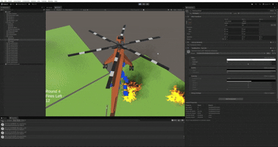

# 🚁 Helicopter Firefighting Simulation (Unity)

## 1. 프로젝트 소개
본 프로젝트는 Unity를 활용하여 개발한 **3D 헬리콥터 시뮬레이션 게임**입니다.  
플레이어는 헬리콥터를 조작하여 산불을 진압하는 미션을 수행하며, 물리 기반 이동과 지형 상호작용을 중심으로 설계되었습니다.

---

## 2. 핵심 기능
- 헬리콥터 3D 자유 이동 시스템 (상하/전후/회전)
- Rigidbody 기반 물리 제어
- 지형 충돌 처리 및 관통 방지
- 카메라 추적 시스템 (플레이어 중심)
- 화재 진압 시스템 (물 투하 로직)

---

## 3. 기술 구현

### 3.1 물리 기반 이동 시스템
- `Rigidbody`를 활용하여 헬리콥터 이동 구현
- `AddForce()` 및 `MovePosition()`을 사용하여 자연스러운 가속/감속 처리
- `FixedUpdate()`에서 물리 연산 처리하여 프레임 의존성 제거

---

### 3.2 충돌 처리 및 지형 관통 문제 해결
**문제**
- 헬리콥터가 지형을 통과하는 현상 발생

**원인**
- 기본 Collision Detection이 `Discrete`로 설정되어 고속 이동 시 충돌 누락

**해결**
- `Collision Detection → Continuous Dynamic` 적용
- Rigidbody Interpolation 활성화 (`Interpolate`)
- 이동 로직을 `Update()` → `FixedUpdate()`로 변경

---

### 3.3 콜라이더 구조 최적화 (Compound Collider)
**문제**
- 단일 Box Collider 사용 시 헬리콥터 빈 공간까지 충돌 발생

**해결**
- 여러 개의 콜라이더를 조합하는 **Compound Collider 구조 적용**

**구성**
- Body → Box Collider
- Tail → Box Collider
- Landing Skid(바퀴) → Sphere Collider

**효과**
- 불필요한 충돌 제거
- 실제 형태에 가까운 물리 구현
- 성능 유지

---

### 3.4 구조 설계
- 부모 오브젝트에 Rigidbody 적용
- 자식 오브젝트에 Collider 분산 배치
- 렌더링 모델과 물리 처리 분리 설계

---

## 4. 문제 해결 경험

### 문제 1: 지형 관통
- 원인: 빠른 이동 + Discrete 충돌 방식  
- 해결: Continuous Dynamic + FixedUpdate 적용  

### 문제 2: 부정확한 충돌 영역
- 원인: 단일 Collider 구조  
- 해결: Compound Collider로 구조 재설계  

### 문제 3: 물리 움직임 부자연스러움
- 원인: transform.position 직접 이동  
- 해결: Rigidbody 기반 이동 방식으로 변경  

---

## 5. 실행 방법

### Unity 실행
1. 프로젝트 클론  
2. Unity Hub에서 프로젝트 열기  
3. Scene 실행  

### 조작법
- W / S : 상승 / 하강  
- A / D : 좌우 회전  
- 8546 : 전후좌우 기울기 조정  
- 마우스 : 카메라 조작  

---

## 6. 개발 환경
- Engine: Unity  
- Language: C#  
- Platform: PC  

---

## 7. 향후 개선 계획
- 공기 저항 및 실제 헬리콥터 물리 적용  
- AI 기반 화재 확산 시스템  
- 미션 기반 게임 구조 확장  
- UI 및 사운드 시스템 추가  

---

## 8. 결과

  

---

## 9. 참고사항
본 프로젝트는 프로토타입으로 현재 진행형으로 업데이트 중에 있습니다.
