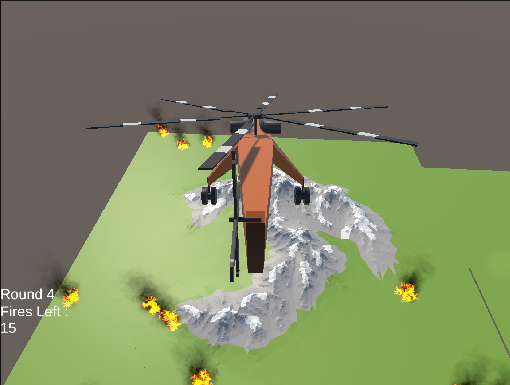

[English](#english) | [日本語](#日本語) | [한국어](#한국어)

# English

# 🚁 Helicopter Firefighting Simulation (Unity)

  
  
  
  

---

## 📌 Overview
This project is a 3D wildfire firefighting simulation game developed with Unity.

The player controls a helicopter to extinguish fires occurring across mountainous terrain.  
As rounds progress, both the number of fires and the difficulty increase.

The project focuses on physics-based helicopter movement, particle collision handling, and game loop system design.

---

## 🎮 Main Features

### 🚁 Physics-Based Helicopter Movement
- Rigidbody-based helicopter movement
- Ascend / descend / rotation / tilt controls
- Natural inertia and movement behavior
- Compound Collider structure for optimized collision handling

### 🔥 Fire System
- Particle-based fire effects
- Water particle collision detection
- Fire health system
- Fire extinguishing and object destruction logic

### 🌎 Random Fire Spawn System
- Random fire generation on terrain surfaces
- Raycast-based terrain surface detection
- Increasing fire count per round

### 📈 Round System
- Progress to the next round after extinguishing all fires
- Each round increases:
  - Number of fires
  - Fire durability
  - Helicopter movement speed

### 🖥 UI System
- Current round display
- Remaining fire count display
- Round clear UI
- Fade in / fade out transition effects

---

## 🛠 Technical Implementation

### Rigidbody-Based Physics
- Physics calculations handled in `FixedUpdate()`
- Movement implemented using `AddForce()`
- Reduced frame dependency

### Collision Handling Improvements
#### Problem
The helicopter occasionally passed through terrain at high speed.

#### Solution
- Collision Detection:
  `Continuous Dynamic`
- Rigidbody Interpolation:
  `Interpolate`
- Physics logic moved from `Update()` to `FixedUpdate()`

### Compound Collider Structure
Implemented multiple colliders instead of a single collider
to better match the helicopter's actual shape.

- Body → Box Collider
- Tail → Box Collider
- Landing Skid → Sphere Collider

### Particle Collision Fire Extinguishing
Using Unity Particle Collision:
- Detect collision between water particles and fire
- Reduce fire health on collision
- Destroy fire object when health reaches zero

---

## ⚙ Development Environment
- Engine: Unity
- Language: C#
- Platform: PC

---

## Needed Assets (Please download in Asset Store yourselfe)

Free Fire VFX URP
Low Poly Helicopters Pack Free
Rocks and Terrains Pack - Low Poly

---

## ⌨ Controls

| Key | Action |
|---|---|
| W / S | Ascend / Descend |
| A / D | Rotate |
| 8 / 5 / 4 / 6 | Tilt Movement |
| Space | Spray Water |
| Mouse | Camera Control |

---

## 🚧 Future Improvements
- Fire spreading system
- Water supply / refill system
- Mission timer
- Sound and environmental effects
- Optimization and balancing

---

## 📚 What I Learned
- Rigidbody-based physics system design
- Compound Collider optimization
- Unity Particle Collision system
- Coroutine-based scene transition effects
- Game loop structure implementation
- Unity UI system integration

---

## 📌 Notes
This project is currently being continuously expanded and improved as an ongoing prototype.

---

# 日本語

# 🚁 Helicopter Firefighting Simulation (Unity)

  
  
  
  

---

## 📌 プロジェクト概要
Unityを使用して開発した3D山火事消火シミュレーションゲームです。

プレイヤーはヘリコプターを操作し、山岳地帯で発生する火災を消火します。  
ラウンドが進むごとに火災数と難易度が増加します。

本プロジェクトでは、
物理ベースのヘリコプター制御、
パーティクル衝突判定、
ゲームループ設計を中心に実装しました。

---

## 🎮 主な機能

### 🚁 物理ベースのヘリコプター移動
- Rigidbodyを利用した移動システム
- 上昇 / 下降 / 回転 / 傾き制御
- 慣性を考慮した自然な挙動
- Compound Colliderによる衝突最適化

### 🔥 火災システム
- パーティクルベースの火災表現
- 水パーティクルとの衝突判定
- 火災HPシステム
- 消火時のオブジェクト削除処理

### 🌎 ランダム火災生成システム
- 地形表面へのランダム火災生成
- Raycastによる地形表面検出
- ラウンドごとの火災数増加

### 📈 ラウンドシステム
- すべての火災を消火すると次ラウンドへ進行
- ラウンドごとに:
  - 火災数増加
  - 火災耐久値増加
  - ヘリコプター速度増加

### 🖥 UIシステム
- 現在ラウンド表示
- 残り火災数表示
- ラウンドクリアUI
- フェードイン / フェードアウト演出

---

## 🛠 技術実装

### Rigidbodyベース物理処理
- `FixedUpdate()`で物理演算を処理
- `AddForce()`による移動実装
- フレーム依存を軽減

### 衝突処理改善
#### 問題
高速移動時にヘリコプターが地形を貫通する問題が発生

#### 解決
- Collision Detection:
  `Continuous Dynamic`
- Rigidbody Interpolation:
  `Interpolate`
- 物理処理を`Update()`から`FixedUpdate()`へ移行

### Compound Collider構造
単一Colliderではなく複数Colliderを組み合わせ、
ヘリコプター形状に近い衝突構造を実装。

- Body → Box Collider
- Tail → Box Collider
- Landing Skid → Sphere Collider

### パーティクル衝突による消火システム
UnityのParticle Collision機能を利用し:
- 水パーティクルと火災の衝突判定
- 衝突時に火災HP減少
- HPが0になると火災削除

---

## ⚙ 開発環境
- Engine: Unity
- Language: C#
- Platform: PC

---

## 必要なアセット（Asset Storeから各自インストールしてください）

Free Fire VFX URP
Low Poly Helicopters Pack Free
Rocks and Terrains Pack - Low Poly

---

## ⌨ 操作方法

| Key | Action |
|---|---|
| W / S | 上昇 / 下降 |
| A / D | 回転 |
| 8 / 5 / 4 / 6 | 傾き移動 |
| Space | 放水 |
| Mouse | カメラ操作 |

---

## 🚧 今後の改善予定
- 火災拡散システム
- 給水システム
- ミッション制限時間
- サウンド / 環境演出追加
- 最適化とゲームバランス調整

---

## 📚 このプロジェクトで学んだこと
- Rigidbodyベース物理設計
- Compound Collider構造
- Unity Particle Collision活用
- Coroutineによる演出制御
- ゲームループ設計
- Unity UIシステム活用

---

## 📌 備考
現在も継続的に機能追加・改善を行っているプロトタイププロジェクトです。

---

## 한국어

# 🚁 Helicopter Firefighting Simulation (Unity)

  
  
  
  

## 📌 프로젝트 소개
Unity를 활용하여 개발한 3D 산불 진압 시뮬레이션 게임입니다.

플레이어는 헬리콥터를 조작하여 산악 지형 곳곳에 발생하는 화재를 진압해야 하며,  
라운드가 진행될수록 화재 수와 난이도가 증가합니다.

물리 기반 헬리콥터 이동, 파티클 충돌 처리, 라운드 시스템 등을 직접 구현했습니다.

---

## 🎮 주요 기능

### 🚁 헬리콥터 물리 이동 시스템
- Rigidbody 기반 이동 구현
- 상승 / 하강 / 회전 / 기울기 제어
- 관성 및 자연스러운 움직임 처리
- Compound Collider 기반 충돌 최적화

### 🔥 화재 시스템
- 파티클 기반 화재 표현
- 물 파티클 충돌 감지
- 화재 체력 시스템 구현
- 화재 진압 시 오브젝트 제거

### 🌎 랜덤 화재 생성 시스템
- 맵 표면 랜덤 위치에 화재 생성
- Raycast 기반 지형 표면 탐색
- 라운드별 화재 수 증가

### 📈 라운드 시스템
- 모든 화재 진압 시 다음 라운드 진행
- 라운드가 증가할수록:
  - 화재 수 증가
  - 화재 체력 증가
  - 헬리콥터 이동 속도 증가

### 🖥 UI 시스템
- 현재 라운드 표시
- 남은 화재 개수 표시
- 라운드 클리어 UI
- 페이드 인 / 아웃 연출

---

## 🛠 기술 구현

### Rigidbody 기반 이동 처리
- `FixedUpdate()`에서 물리 연산 처리
- `AddForce()` 기반 이동 구현
- 프레임 의존성 최소화

### 충돌 처리 개선
#### 문제
고속 이동 시 헬리콥터가 지형을 관통하는 문제 발생

#### 해결
- Collision Detection:
  `Continuous Dynamic`
- Rigidbody Interpolation:
  `Interpolate`
- 물리 처리 로직을 `FixedUpdate()`로 이전

### Compound Collider 구조 적용
단일 Collider 대신 여러 Collider를 조합하여
실제 헬리콥터 형태와 유사한 충돌 구조 구현

- Body → Box Collider
- Tail → Box Collider
- Landing Skid → Sphere Collider

### 파티클 충돌 기반 화재 진압
Unity Particle Collision 기능을 활용하여:
- 물 입자와 화재 충돌 감지
- 충돌 시 화재 체력 감소 처리
- 체력 소진 시 화재 제거

---

## ⚙ 개발 환경
- Engine: Unity
- Language: C#
- Platform: PC

---

## 필요 에셋 (에셋 스토어에서 직접 다운받아 주세요)

Free Fire VFX URP
Low Poly Helicopters Pack Free
Rocks and Terrains Pack - Low Poly

---

## ⌨ 조작 방법

| Key | Action |
|---|---|
| W / S | 상승 / 하강 |
| A / D | 회전 |
| 8 / 5 / 4 / 6 | 기울기 이동 |
| Space | 물 분사 |
| Mouse | 카메라 조작 |

---

## 🚧 향후 개선 계획
- 화재 확산 시스템
- 물 보급 시스템
- 미션 제한 시간
- 사운드 및 환경 효과 추가
- 최적화 및 게임 밸런싱

---

## 📚 프로젝트를 통해 배운 점
- Rigidbody 기반 물리 처리 구조
- Compound Collider 설계 방식
- Particle Collision 시스템 활용
- Coroutine 기반 연출 처리
- 게임 루프(Game Loop) 구조 설계
- Unity UI 시스템 활용

---

## 📌 참고사항
현재 지속적으로 기능을 확장 및 개선 중인 프로토타입 프로젝트입니다.

